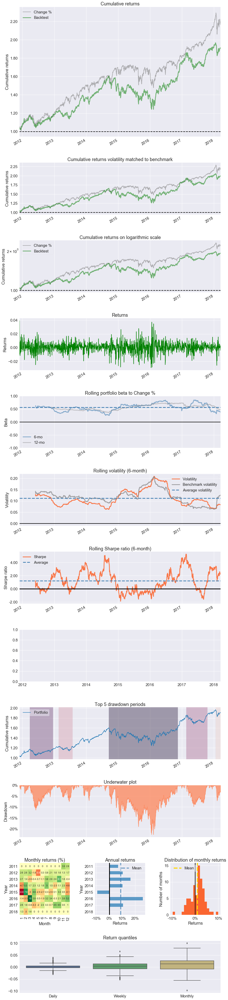

```python
#  Returns Tear Sheet for TSE:ZEB (BMO Equal Weighted Bank Index ETF)

#  Winter 2018 AFM 121 Section 2 Group 11

#  Generated using pyfolio and matplotlib in Python

#  Author: Jack Zhang
```


```python
%matplotlib inline
```


```python
import pandas as pd
import pyfolio as pf
```


```python
# load data from csv as DataFrame
prices = pd.read_csv('ZEB Historical Data.csv')
benchmark = pd.read_csv('SP500 Historical Data.csv')

# reverse the rows
prices = prices[::-1]
benchmark = benchmark[::-1]

# convert the strings to DateTime objects and set that column as the index
prices['Date'] = pd.to_datetime(prices.Date)
prices.set_index('Date', inplace=True)

benchmark['Date'] = pd.to_datetime(benchmark.Date)
benchmark.set_index('Date', inplace=True)

# divide 'Change %' column by 100
change = prices['Change %'].div(100)
bench_change = benchmark['Change %'].div(100)

# drop all the errors caused from division by zero
change.dropna(inplace=True)
bench_change.dropna(inplace=True)

# note to self: rolling_fama_french() has been disabled in source file. Change it back later!
pf.tears.create_returns_tear_sheet(change, benchmark_rets=bench_change)
```

    Entire data start date: 2011-11-30
    Entire data end date: 2018-03-20
    Backtest months: 75
    


<div>
<style>
    .dataframe thead tr:only-child th {
        text-align: right;
    }

    .dataframe thead th {
        text-align: left;
    }

    .dataframe tbody tr th {
        vertical-align: top;
    }
</style>
<table border="1" class="dataframe">
  <thead>
    <tr style="text-align: right;">
      <th></th>
      <th>Backtest</th>
    </tr>
  </thead>
  <tbody>
    <tr>
      <th>Annual return</th>
      <td>10.9%</td>
    </tr>
    <tr>
      <th>Cumulative returns</th>
      <td>91.3%</td>
    </tr>
    <tr>
      <th>Annual volatility</th>
      <td>11.8%</td>
    </tr>
    <tr>
      <th>Sharpe ratio</th>
      <td>0.94</td>
    </tr>
    <tr>
      <th>Calmar ratio</th>
      <td>0.48</td>
    </tr>
    <tr>
      <th>Stability</th>
      <td>0.86</td>
    </tr>
    <tr>
      <th>Max drawdown</th>
      <td>-22.6%</td>
    </tr>
    <tr>
      <th>Omega ratio</th>
      <td>1.18</td>
    </tr>
    <tr>
      <th>Sortino ratio</th>
      <td>1.34</td>
    </tr>
    <tr>
      <th>Skew</th>
      <td>-0.14</td>
    </tr>
    <tr>
      <th>Kurtosis</th>
      <td>2.65</td>
    </tr>
    <tr>
      <th>Tail ratio</th>
      <td>0.98</td>
    </tr>
    <tr>
      <th>Daily value at risk</th>
      <td>-1.4%</td>
    </tr>
    <tr>
      <th>Alpha</th>
      <td>0.03</td>
    </tr>
    <tr>
      <th>Beta</th>
      <td>0.58</td>
    </tr>
  </tbody>
</table>
</div>


<div>
<style>
    .dataframe thead tr:only-child th {
        text-align: right;
    }

    .dataframe thead th {
        text-align: left;
    }

    .dataframe tbody tr th {
        vertical-align: top;
    }
</style>
<table border="1" class="dataframe">
  <thead>
    <tr style="text-align: right;">
      <th>Worst drawdown periods</th>
      <th>Net drawdown in %</th>
      <th>Peak date</th>
      <th>Valley date</th>
      <th>Recovery date</th>
      <th>Duration</th>
    </tr>
  </thead>
  <tbody>
    <tr>
      <th>0</th>
      <td>22.62</td>
      <td>2014-09-18</td>
      <td>2016-02-11</td>
      <td>2016-11-17</td>
      <td>566</td>
    </tr>
    <tr>
      <th>1</th>
      <td>11.41</td>
      <td>2012-03-26</td>
      <td>2012-06-04</td>
      <td>2012-12-18</td>
      <td>192</td>
    </tr>
    <tr>
      <th>2</th>
      <td>9.85</td>
      <td>2017-02-22</td>
      <td>2017-05-17</td>
      <td>2017-10-19</td>
      <td>172</td>
    </tr>
    <tr>
      <th>3</th>
      <td>7.54</td>
      <td>2013-02-20</td>
      <td>2013-06-20</td>
      <td>2013-07-29</td>
      <td>114</td>
    </tr>
    <tr>
      <th>4</th>
      <td>7.17</td>
      <td>2018-01-22</td>
      <td>2018-02-09</td>
      <td>NaT</td>
      <td>NaN</td>
    </tr>
  </tbody>
</table>
</div>




